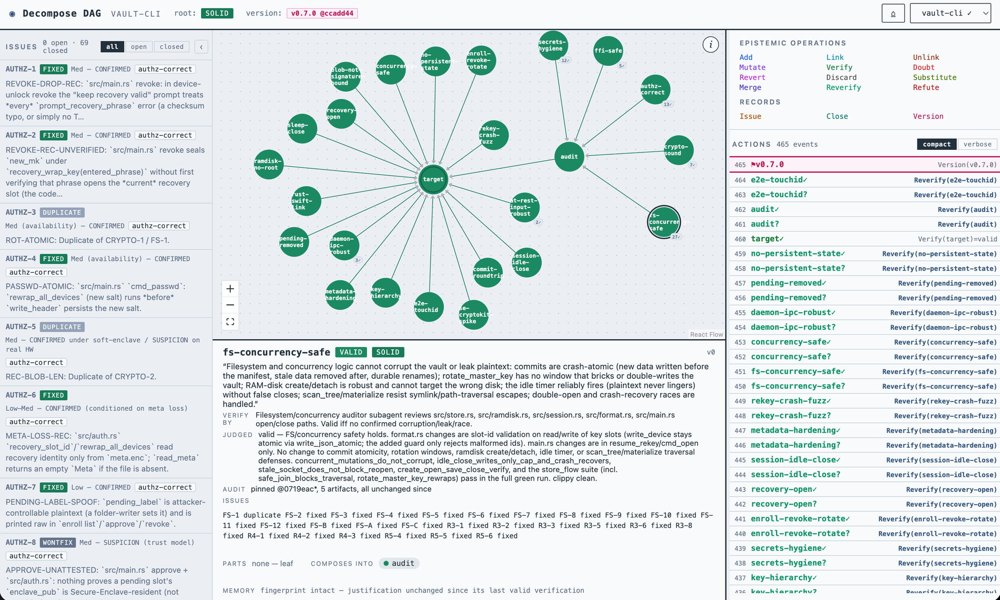
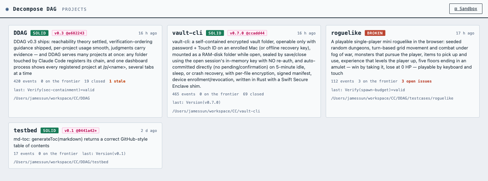

# Decompose DAG (DDAG)

**An epistemic scaffold for vibe coding.** DDAG turns a build target into a
graph of claims, makes a coding agent verify them bottom-up against evidence,
and keeps an honest, replayable record of every decision, including the ones
that turned out wrong. Agents use it through an MCP server; humans watch it
through a live dashboard.



## Why

Coding with an agent has two failure modes that a todo list cannot catch:

1. **Sloppy product.** The agent reports "done" on things it never checked, and
   nothing forces it to say what evidence it looked at.
2. **Audits that never end.** Every audit pass finds new issues, because the
   audit is a report, not a plan: nobody can say which properties have been
   examined by which method, and which have not.

DDAG answers both with one structure. The target is the root claim. Claims are
decomposed into parts (arcs point part → whole). A claim can only be judged
when all of its parts are solid, so the agent has to work bottom-up. Every
judgment carries evidence and is pinned to the git commit and the hashes of
the files it cites; when those files change, the judgment is marked stale on
the dashboard. Findings are recorded as issues on the claim they refute, with
full detail, and a working version is recorded after the commit that
concluded it. The root is solid only when every claim under it has been
verified. The whole history is an append-only chain of events, replayed
deterministically, so the process itself can be read back.

## Install

Requires Node.js 22 or later, git, and [Claude Code](https://claude.com/claude-code)
(any MCP client works; the instructions below are for Claude Code).

```sh
git clone https://github.com/DreamC0der-AI/ddag.git
cd ddag
npm install
npm run build:mcp         # dist/ddag-mcp.mjs        — the agent tool
npm run build:dashboard   # dist/ddag-dashboard.mjs  — the human view
```

Register the tool once, with no chain argument. It uses `./ddag.json` in
whatever folder Claude Code is opened in:

```sh
claude mcp add --scope user ddag -- node /absolute/path/to/ddag/dist/ddag-mcp.mjs
```

Start the dashboard once and leave it running. Tabs stay live while Claude
Code sessions come and go:

```sh
npm run dashboard         # http://localhost:5199/  (PORT=... to change it)
```

## Use

Open any project folder in Claude Code and ask it to build with DDAG:

> Build a CLI that ... Use ddag: decompose the target first, verify bottom-up,
> record what you find.

The first operation creates `<folder>/ddag.json` and registers the project in
`~/.ddag/projects.json` (set `DDAG_HOME` to move the registry). From then on:

- The agent adds claims with a `verify:` criterion that names what evidence
  settles each one, and a `rationale` for every structural decision.
- It works the **frontier**, the claims whose parts are all solid. Nothing off
  the frontier can be judged; the server refuses it.
- Every `verify` carries evidence written for a reader who was not there, and
  is pinned to the git HEAD and the files it cites.
- Wrong turns are recorded as `verify = invalid`, dead ends as `discard`.
  They are the most useful entries when you read the chain back.
- When the root turns **solid**, the target is verified. Standing is one line:

```
Root vault-cli: SOLID — the target is verified. Frontier: (empty)
```

**One project, one chain.** The build, its audits, its fixes and its versions
all go on the folder's `ddag.json`. Several Claude Code sessions may work the
same folder at once: each operation locks the file, catches up on what the
other session wrote, applies against the current state, and writes
atomically. An operation the other session made illegal is refused with the
reason.

### Auditing with the graph

An audit is a claim graph, not a report. Ask the agent to audit and it follows
the protocol in the tool's instructions:

1. The root of the audit is the claim in scope, with the attacker model and
   exclusions in its text, added under the project's target.
2. It is decomposed by **property**, never by topic: "a revoked device cannot
   read the vault", not "authz". Each leaf's `verify:` names the method that
   settles it (a fuzz harness, an interleaving test, crash injection, a review
   of named functions).
3. The pending leaves are the audit plan. A property that holds is verified
   with what was run. One shown false is refuted and the finding is recorded as
   an issue on that property.
4. A finding that fits no claim reveals a missing property: add it, then refute
   it. Growth is visible and bounded by the tree.
5. The fixer never re-verifies its own fix. After the issue closes, an
   independent re-examination re-judges the claim, and the server says so when
   a session verifies a claim whose issue it closed.
6. The root is solid only when every property has been judged by its stated
   method. What remains unexamined is visible as absence, not as a surprise
   next round.

See DOCTRINE.md, "Auditing with the Graph".

## The dashboard

### Projects



`http://localhost:5199/` lists every registered project: root solid or
broken, latest version and the commit it sits on, event count, frontier size,
open and closed issues, the last event, and the folder. Click a card to open
the project. The Sandbox button opens a random simulator for learning the
operations without a project.

### Project view

`http://localhost:5199/p/<name>` is the live view of one chain. It follows the
file; nothing needs a refresh. Its sections, from the first screenshot:

- **Toolbar.** Project name, root standing (SOLID or BROKEN), the latest
  version chip (`v0.7.0 @ccadd44`, with `*` when the tree was dirty), the home
  button and a project switcher.
- **Issues pane** (left, collapsible). Every recorded finding with its key,
  outcome (open, fixed, wontfix, invalid, duplicate), severity, the claim it
  concerns and its full detail on expand. Filters: all, open, closed. A claim
  whose issues are all closed but whose judgment is still invalid is tagged
  "ready to re-verify".
- **Graph** (centre). Nodes are claims; arcs point from part to whole; the
  root has an inner ring. Green is valid, yellow pending, red invalid. A
  shadow marks the frontier. A `!` badge marks a judgment that is stale, with
  the changed hunks and their function names in the tooltip. A count badge
  shows open issues on the claim in red, or all-closed in grey. The `i`
  button shows the legend.
- **Detail panel** (bottom). The selected claim: its text, verdict and
  standing; **Verify by**, the criterion; **Judged**, the evidence of the
  last judgment; **Audit**, what the judgment is pinned to and whether it
  still matches (`pinned @0719eac*, 5 artifacts, all unchanged since`), or
  which files changed and where; **Issues** on this claim; **Parts** and
  **Composes into**; and **Memory**, whether the fingerprint is intact, so a
  reopened claim heals on its own when its parts are restored.
- **Epistemic operations** (top right). The six atoms (Add, Link, Unlink,
  Mutate, Verify, Doubt), the composites (Revert, Discard, Substitute, Merge,
  Reverify, Refute), and the **Records** (Issue, Close, Version). Hover a
  composite or a record for what it does.
- **Actions** (right). The chain, newest first. Compact shows one line per
  event with its evidence on hover; verbose explains each event: what was
  done, its grounds, and what it changed. Versions show as bands.

The dashboard is read-only, serves only registered chain paths, and binds to
localhost.

## The operations

Everything an agent can do is one of these. The kernel is small on purpose:
structure settles nothing and can only reopen doubt; judgment is the only
source of trust.

| Operation | What it does |
|---|---|
| `add` | Articulate a new claim as a part of an existing one, with its `verify:` criterion and a rationale. |
| `link` / `unlink` | Reuse an existing claim as a part; withdraw support. |
| `mutate` | The claim now reads differently. Its judgment reopens. |
| `verify` | Submit the judgment, valid or invalid, with evidence. Only on the frontier. Pinned to HEAD and the cited files. |
| `doubt` | Withdraw a judgment. |
| `revert` | Back to the last verified wording. |
| `discard` | Abandon a line of work. |
| `substitute` | Swap one part for another under the same whole. |
| `merge` | Two claims are the same claim. |
| `reverify` | Re-judge a stale claim on today's evidence, in one call. |
| `refute` | Withdraw a valid claim a finding has shown false, and judge it invalid. |
| `restructure` | A topic gets its properties: add the parts it stands for, all or nothing. |
| `issue_open` / `issue_close` / `issue_list` | Record a finding with its full detail on the claim it concerns; close it with an outcome and what changed; the fixer's worklist. |
| `version_mark` / `version_list` | Declare a working version after the commit that concluded it; every version with what the chain said of it then. |
| `graph_state` / `graph_history` / `graph_audit` | The standing and frontier; the chain; which judgments rest on code that changed since, with the hunks. |
| `graph_new` / `graph_open` | Start a chain in this folder; open one under it. |

## Storage

- `<project>/ddag.json` is the chain: an ordered list of events, each with its
  operation, rationale or evidence, provenance (commit, dirty flag, artifact
  hashes) and a snapshot. It belongs in the repository; it is the project's
  decision log.
- `~/.ddag/projects.json` is the registry of folders that have a chain, which
  the dashboard reads. A project's name is its folder's basename.

## Development

```sh
npm test                  # vitest: kernel laws, chain, MCP server, dashboard, cases
npm run typecheck
npm run dev               # the web app with HMR on :5299 (/api proxied to :5199)
```

- **DESIGN.md** is the kernel: what each operation does and what is guaranteed.
- **DOCTRINE.md** is how to play it well: when to open a graph, when to
  decompose, how to judge, how to repair, how to audit.
- **ALGORITHMS.md** names the kernel's algorithms against the design.
- DDAG is built through DDAG: the repository's own chain and the projects
  used to exercise it are the author's working record and are not published.
  `ddag.json`, `testcases/` and `testbed/` are ignored, so a chain you start
  in this folder stays yours.

## License

MIT. Built by [dream coder](https://github.com/DreamC0der-AI).
